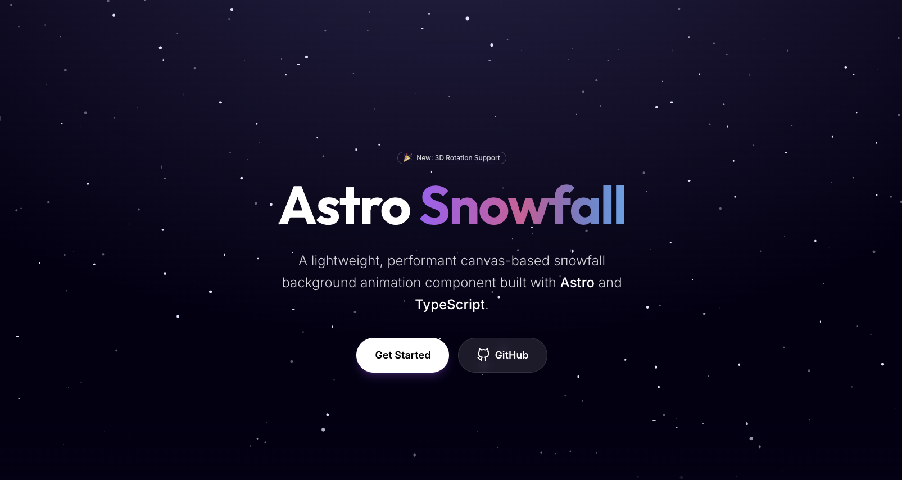

# Astro Snowfall

A lightweight, performant canvas-based snowfall background animation component built with Astro and TypeScript. Ported from [react-snowfall](https://github.com/cahilfoley/react-snowfall) for use in Astro projects.



## Features

- ✨ **Highly Configurable** - Control snowflake color, size, speed, wind, and more
- 🎨 **3D Rotation Effects** - Enable realistic tumbling motion with 3D transformations
- 📱 **Fully Responsive** - Canvas automatically resizes with window/container
- ⚡ **Optimized Performance** - Uses `requestAnimationFrame` and batch rendering
- 🎯 **Type-Safe** - Full TypeScript support with comprehensive type definitions
- 🚀 **Zero Runtime Overhead** - Leverages Astro's static generation
- 🖼️ **Image Support** - Use custom images instead of circles (optional)
- 🎮 **Programmatic Control** - Play, pause, and update animations dynamically

## Installation

### Option 1 (recommended)

```bash
npm install astro-snowfall
```

### Option 2

```bash
npx shadcn@latest add https://fermeridamagni.github.io/astro-snowfall/r/snowfall.json
```

### Option 3

```bash
# Copy the snowfall library
cp -r src/lib/snowfall your-project/src/lib/

# Copy the Snowfall component
cp src/components/Snowfall.astro your-project/src/components/
```

No external dependencies required!

## Quick Start

### Basic Usage

```astro
---
import Snowfall from 'astro-snowfall';

/**
 * or if you are using the library directly:
 * import Snowfall from '../components/Snowfall.astro';
 */
---

<div class="container">
  <Snowfall />
  
  <main>
    <h1>Your Content Here</h1>
  </main>
</div>

<style>
  .container {
    position: relative;
    min-height: 100vh;
  }
</style>
```

### Full-Screen Background

```astro
---
import Snowfall from 'astro-snowfall';

/**
 * or if you are using the library directly:
 * import Snowfall from '../components/Snowfall.astro';
 */
---

<html>
  <body>
    <Snowfall 
      class="snowfall-background"
      color="#fff"
      snowflakeCount={200}
      enable3DRotation={true}
    />
    
    <main>
      <!-- Your content -->
    </main>
  </body>
</html>

<style>
  .snowfall-background {
    position: fixed;
    inset: 0;
    width: 100vw;
    height: 100vh;
    pointer-events: none;
    z-index: 0;
  }
  
  main {
    position: relative;
    z-index: 1;
  }
</style>
```

## Configuration Props

All props are optional. The component uses sensible defaults for all properties.

### Visual Properties

| Prop | Type | Default | Description |
|------|------|---------|-------------|
| `color` | `string` | `'#dee4fd'` | The color of the snowflakes (any valid CSS color) |
| `radius` | `[number, number]` | `[0.5, 3.0]` | Min and max radius of snowflakes in pixels |
| `opacity` | `[number, number]` | `[1, 1]` | Min and max opacity (0-1 range) |

### Animation Properties

| Prop | Type | Default | Description |
|------|------|---------|-------------|
| `speed` | `[number, number]` | `[1.0, 3.0]` | Min and max vertical falling speed |
| `wind` | `[number, number]` | `[-0.5, 2.0]` | Min and max horizontal wind velocity |
| `rotationSpeed` | `[number, number]` | `[-1.0, 1.0]` | Min and max rotation speed (degrees/frame) |
| `changeFrequency` | `number` | `200` | Frames between target speed/wind updates |
| `enable3DRotation` | `boolean` | `false` | Enable 3D tumbling rotation effect |

### Quantity

| Prop | Type | Default | Description |
|------|------|---------|-------------|
| `snowflakeCount` | `number` | `150` | Number of snowflakes to render |

### Styling

| Prop | Type | Default | Description |
|------|------|---------|-------------|
| `class` | `string` | `undefined` | CSS class name for the canvas element |
| `style` | `string` | `undefined` | Inline CSS styles for the canvas |

### Advanced

| Prop | Type | Default | Description |
|------|------|---------|-------------|
| `images` | `CanvasImageSource[]` | `undefined` | Array of images to use instead of circles |

## Examples

### Winter Scene

```astro
<Snowfall 
  color="#ffffff"
  snowflakeCount={300}
  speed={[0.5, 2]}
  wind={[-1, 1]}
  radius={[0.5, 4]}
  enable3DRotation={true}
/>
```

### Light Snowfall

```astro
<Snowfall 
  color="rgba(255, 255, 255, 0.6)"
  snowflakeCount={50}
  speed={[0.5, 1.5]}
  wind={[0, 0.5]}
  radius={[1, 2]}
/>
```

### Colored Confetti Effect

```astro
<Snowfall 
  color="#ff69b4"
  snowflakeCount={100}
  speed={[2, 5]}
  wind={[-2, 2]}
  radius={[1, 5]}
  enable3DRotation={true}
  rotationSpeed={[-5, 5]}
/>
```

### Heavy Blizzard

```astro
<Snowfall 
  color="#e0f2ff"
  snowflakeCount={500}
  speed={[3, 6]}
  wind={[-3, 3]}
  radius={[0.5, 3]}
  opacity={[0.4, 0.9]}
/>
```

## How It Works

The snowfall animation is built with three core components:

### 1. **Snowflake Class** (`Snowflake.ts`)
Each snowflake is an individual entity with its own properties:
- Position (x, y coordinates)
- Velocity (speed and wind)
- Appearance (radius, opacity, rotation)
- Physics (lerping between target values)

### 2. **SnowfallCanvas Controller** (`SnowfallCanvas.ts`)
Manages the animation lifecycle:
- Creates and maintains snowflake collection
- Runs animation loop with `requestAnimationFrame`
- Updates positions based on physics
- Renders to canvas with optimizations
- Provides play/pause/resize controls

### 3. **Astro Component** (`Snowfall.astro`)
Wraps everything in a user-friendly interface:
- Accepts configuration props
- Sets up canvas element
- Initializes controller on client-side
- Handles responsive resizing with `ResizeObserver`
- Manages cleanup on navigation

### Physics & Animation

The animation uses frame-based updates for consistent behavior:

1. **Linear Interpolation (lerp)**: Snowflakes smoothly transition between random speed/wind values
2. **Frame Calculation**: Adjusts for varying frame rates to maintain consistent motion
3. **Wrapping**: Snowflakes wrap around screen edges for infinite effect
4. **3D Rotation**: Optional transformation matrices for realistic tumbling

### Performance Optimizations

- **Batch Rendering**: When using circles without 3D rotation, all snowflakes are drawn in a single `beginPath()` call
- **Target FPS**: Animation targets 60fps with frame delta calculations
- **Efficient Updates**: Only updates visible properties
- **Canvas Clipping**: Clears and redraws only changed regions

## Responsive Behavior

The canvas automatically adapts to its container size using `ResizeObserver`:

```typescript
// Monitors container size changes
const resizeObserver = new ResizeObserver(() => {
  canvas.width = canvas.offsetWidth;
  canvas.height = canvas.offsetHeight;
  snowfall.resize(canvas.width, canvas.height);
});
```

This ensures the animation works perfectly on:
- Desktop browsers
- Mobile devices
- Responsive layouts
- Window resizing
- Orientation changes

## Browser Support

Works in all modern browsers that support:
- HTML5 Canvas API
- `requestAnimationFrame`
- `ResizeObserver`
- ES6+ JavaScript

### Compatibility
- ✅ Chrome/Edge 90+
- ✅ Firefox 88+
- ✅ Safari 14+
- ✅ iOS Safari 14+
- ✅ Android Chrome 90+

## Performance Considerations

### Canvas Size
Larger canvases require more rendering time. For full-screen effects:
- Desktop: 300-500 snowflakes work well
- Mobile: Limit to 100-200 snowflakes

### 3D Rotation
Enabling 3D rotation disables batch rendering optimization. Each snowflake is drawn individually with transforms.

### Frame Rate
The animation targets 60fps but gracefully degrades on slower devices. Frame calculations ensure motion remains consistent.

## TypeScript Support

Full type definitions are included:

```typescript
import type { 
  SnowflakeProps,
  SnowflakeConfig,
  SnowfallCanvasConfig 
} from '../lib/snowfall/types';
```

## Project Structure

```
src/
├── components/
│   └── Snowfall.astro              # Main Astro component
├── lib/
│   └── snowfall/
│       ├── Snowflake.ts            # Individual snowflake class
│       ├── SnowfallCanvas.ts       # Animation controller
│       ├── types.ts                # TypeScript definitions
│       ├── utils.ts                # Helper functions
│       └── config.ts               # Default configuration
└── pages/
    └── index.astro                 # Demo page
```

## Credits

This implementation is based on [react-snowfall](https://github.com/cahilfoley/react-snowfall) by Cahil Foley, adapted for Astro and enhanced with:
- Native TypeScript types
- Astro-specific patterns
- ResizeObserver for responsive behavior
- Enhanced 3D rotation
- Optimized rendering pipeline

## License

MIT License - Feel free to use in your projects!

## Contributing

Contributions are welcome! Please feel free to submit a Pull Request.

## Support

If you encounter any issues or have questions, please open an issue on GitHub.

---

Built with ❤️ by [@fermeridamagni](https://github.com/fermeridamagni)
